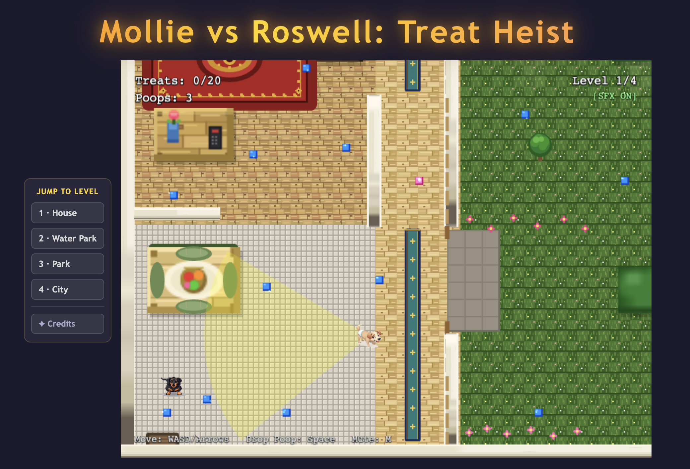

# Mollie vs. Roswell: Treat Heist



A top-down stealth game built with **TypeScript 5.6 + Vite 6 + Phaser 3.87**.

Help **Mollie** the dachshund steal every treat across 4 increasingly wild locations while avoiding **Roswell** the watchdog. Drop poop to stun him, collect all the treats, and escape. Beat all four levels to roll the credits!

---

## Quick Start

```bash
npm install
npm run dev        # → http://localhost:3000
npm run build      # production build → dist/
```

---

## Controls

### Desktop (keyboard)

| Key | Action |
|-----|--------|
| WASD / Arrow Keys | Move Mollie |
| Space | Drop poop (3 charges) |
| M | Toggle mute |
| ESC | Back to menu (from Credits) |

### Mobile (touch)

| Control | Action |
|---------|--------|
| Left half of screen — drag | Virtual joystick (move Mollie) |
| 💩 button (bottom-right) | Drop poop |

Touch controls appear automatically on touch-capable devices. Keyboard always overrides the joystick when both are active.

---

## Level Progression

| Level | Name | Treats | Background Music |
|-------|------|--------|-----------------|
| 1 | The House | 20 | Synth ambient (200 Hz white noise) |
| 2 | Water Park | 25 | `public/assets/poollevel.mp3` |
| 3 | City Park | 28 | `public/assets/cityparklevel.wav` |
| 4 | City Streets | 30 | `public/assets/citylevel.wav` |

After completing Level 4 the game automatically transitions to the **Credits screen**.
Getting caught restarts the current level.

---

## Level Menu (Left Panel)

The left-side HTML panel lets you jump to any level at any time without replaying earlier levels.

| Button | Action |
|--------|--------|
| 1 · House | Start Level 1 immediately |
| 2 · Water Park | Start Level 2 immediately |
| 3 · Park | Start Level 3 immediately |
| 4 · City | Start Level 4 immediately |
| ✦ Credits | Open the Credits screen directly |

Clicking any button stops all active scenes and starts the target scene.
The `window.__phaserGame` global (set in `src/main.ts`) is used by the panel to communicate with Phaser.

---

## Credits Screen

Reached automatically after beating Level 4, or via the **✦ Credits** button in the level menu.

- Scrolling credits text (55 px/s upward) with styled sections for developers, music, and source link
- Credits music: `public/assets/credits.wav` (looping, stopped on exit)
- **[ Back to Menu ]** button or **ESC** returns to the Title Screen
- Mute state (toggled in-game with **M** or the HUD button) carries through to the credits music

**Exact credits text:**
```
Developed by : Jon And Julianna
Music by: Freesound.org
github.com/kleppy/mollieroswell
```

---

## Audio

| Sound | Trigger | Source |
|-------|---------|--------|
| Roswell bark | Periodic (distance-attenuated) | `public/assets/dogbark.wav` |
| Level 2 music | While playing Level 2 | `public/assets/poollevel.mp3` |
| Level 3 music | While playing Level 3 | `public/assets/cityparklevel.wav` |
| Level 4 music | While playing Level 4 | `public/assets/citylevel.wav` |
| Credits music | Credits screen | `public/assets/credits.wav` |
| Ambient noise (L1) | Level 1 background | Synthesised (200 Hz bandpass) |
| Mollie pant | While moving | Synthesised (Web Audio API) |
| Treat crunch | Treat collected | `public/assets/sfx/crunch.mp3` |

Only one background track plays at a time; the previous track is stopped before the next starts.
Audio starts after the first user interaction (title screen click/tap or key press), satisfying both desktop and **mobile autoplay policy**. On mobile, the Web Audio context is explicitly resumed on that first tap before the game scene loads.
Press **M** or click **[SFX ON]** in the HUD to toggle mute. The mute state persists across level transitions and into the Credits screen.

---

## How the AI Works

Roswell uses a four-state FSM:

| State | Behaviour |
|-------|-----------|
| **PATROL** | Loops through level-specific waypoints |
| **CHASE** | Pursues Mollie at increased speed when she enters his vision cone |
| **SEARCH** | Moves to last-seen position, waits 3 s, then resumes patrol |
| **STUNNED** | Steps on poop → 40% speed for 2 s |

**Vision cone:** 70° wide, 250 px range. LOS is blocked by all solid obstacles — hiding behind furniture breaks detection.

---

## Mobile Support

The game runs on modern mobile browsers (Chrome/Safari for iOS and Android).

### Responsive Scaling

Phaser is configured with `Scale.FIT + CENTER_BOTH`: the 800×600 canvas shrinks or grows to fill the available viewport while maintaining its aspect ratio, centered on screen.

### Virtual Joystick

On touch-capable devices a virtual joystick appears automatically in the bottom-left corner:

- **Drag** anywhere on the **left half** of the canvas to move Mollie.
- The translucent base ring stays fixed; the thumb indicator follows your finger within a 56 px radius.
- Releasing the finger stops movement immediately.
- A 💩 **poop button** appears in the **bottom-right** corner — tap it to drop a poop charge.
- If a physical keyboard is also connected its input takes priority over the joystick.

### Touch-Friendly UI

- Level-menu buttons (`index.html`) have `touch-action: manipulation` to remove the 300 ms tap delay and a minimum height of 38 px.
- The **[ Back to Menu ]** button in the Credits screen has extra padding for a larger touch target.

### Performance Safeguards (mobile only)

On touch devices, decorative animation frequency is automatically reduced to keep the frame rate smooth:

| Effect | Desktop interval | Mobile interval |
|--------|-----------------|-----------------|
| Level 2 pool splash | 2 100 / 3 500 ms | 4 500 / 7 000 ms |
| Level 3 pond ripple | 2 800 ms | 5 600 ms |
| Level 3 pollen motes | 1 400 ms | 3 200 ms |
| Level 4 steam vents | 1 100 ms | 2 500 ms |
| Level 4 driving cars | 12 cars | 6 cars (one per lane) |
| Level 4 extra walkers (cw5–cw8) | shown | hidden |

Gameplay mechanics, enemy counts, and collision bodies are unchanged on all platforms.

---

## New Files Added

| File | Purpose |
|------|---------|
| `src/scenes/CreditsScene.ts` | Credits screen (scrolling text, music, back button) |
| `public/assets/credits.wav` | Background music played on the Credits screen |

---

## Tech Stack

- [Phaser 3.87](https://phaser.io/) — game engine (arcade physics, scene management, Web Audio)
- [Vite 6](https://vitejs.dev/) — dev server & bundler
- [TypeScript 5.6](https://www.typescriptlang.org/) — type-safe source
